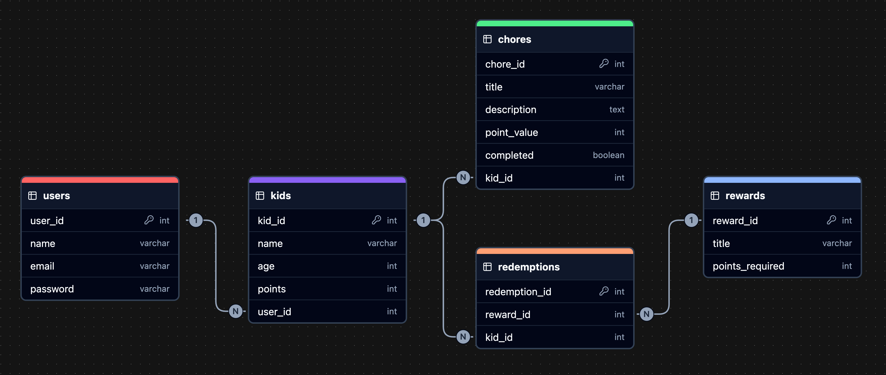

# 🐝 BusyBees: Kids' Chore Management App

## Overview

**BusyBees** is a chore management app designed to make assigning and tracking chores a breeze for parents and fun for kids! With gamified rewards, progress tracking, and an intuitive interface, BusyBees turns household responsibilities into a family collaboration adventure.

### Problem Space

Managing household chores can be challenging for parents, especially with young children. Traditional paper chore charts or manual tracking methods can lead to missed tasks and inconsistent tracking. Kids often lack incentives to engage in chores consistently, leading to friction and unmet responsibilities. BusyBees addresses this by creating a structured, gamified system that makes chore completion transparent, rewarding, and fun.

### User Profile

- **Primary Users**: Parents or guardians of children, who are introducing structured chore routines and want to offer rewards for task completion.
- **Secondary Users**: Children will use the app to view and track their assigned chores, earn points, and redeem rewards.

### Features

- **Parents**
  - As a parent, I want to create an account so that I can access the app and manage my family’s chores.
  - As a parent, I want to create profiles for each of my children so that I can assign chores to them.
  - As a parent, I want to add new chores and assign them to my kids so that I can keep track of their responsibilities.
  - As a parent, I want to set rewards for completed chores so that I can incentivize my kids to finish their tasks.
  - As a parent, I want to track the progress of my children’s chores so that I can ensure tasks are completed on time.
- **Kids**
  - As a child, I want to see a list of my assigned chores so that I know what I need to do.
  - As a child, I want to mark my chores as completed so that I can earn points.
  - As a child, I want to redeem my earned points so that I can enjoy the benefits of completing my chores.

## Implementation

### Tech Stack

- React
- Node.js
- Express
- MySQL
- JWT

### APIs

No external sources of data will be used in the app.

### Sitemap

1. **Home Page**: Welcome page with options to log in or register.
2. **Login/Registration**: Parent login and registration forms.
3. **Dashboard**: Assigned chores, current points, and progress.
4. **Chores Page**: Parent interface to manage chores.
5. **Rewards Store**: Reward catalog for redeeming points.
6. **Settings/Profile**: Account and profile settings for parents.

### Mockups

To be updated.

### Data



### Endpoints

**POST /kids**: Create a new kid profile for a user.

Parameters:
- user_id (int): ID of the parent user.
- name (string): Name of the child.
- age (int): Age of the child.

Response:
```
{
    "kid_id": 3,
    "name": "Charlie",
    "age": 4,
    "points": 0,
    "user_id": 1
}
```

**POST /chores**: Create and assign a chore to a kid.

Parameters:
- title (string): Title of the chore.
- description (string): Description of the chore.
- point_value (int): Points rewarded for the chore.
- kid_id (int): ID of the assignee.

Response:
```
{
  "chore_id": 1,
  "kid_id": 1,
  "title": "Clean Room",
  "description": "Tidy the bedroom",
  "point_value": 30,
  "completed": false
}
```

**PUT /chores/{chore_id}**: Update a chore.

Parameters:
- completed (boolean): New status of the chore.

Response:
```
{
  "chore_id": 1,
  "kid_id": 1,
  "title": "Clean Room",
  "description": "Tidy the bedroom",
  "point_value": 30,
  "completed": true
}
```

**POST /rewards**: Create a new reward.

Parameters:
- title (string): Title of the reward.
- points_required (int): Cost of the reward in points.

Response:
```
{
  "reward_id": 1,
  "title": "Ice Cream Treat",
  "points_required": 100
}
```

**POST /redemptions**: Redeem a reward for a kid profile.

Parameters:
- reward_id (string): ID of the reward.
- kid_id (int): ID of the kid redeeming the reward.

Response:
```
{
  "redemption_id": 1,
  "reward_id": 1,
  "kid_id": 1
}
```

## Roadmap

- Create client
  - Initialize React project with routes and boilerplate pages (Home, Kids, Chores, Rewards).

- Create server
  - Initialize Node.js and Express project with routing and placeholder 200 responses for core endpoints.

- Create database migrations
  - Define schema for Users, Kids, Chores, Rewards, and Redemptions tables using Knex.

- Create seeds with sample data
  - Populate the database with sample Users, Kids, Chores, and Rewards.

- Deploy client and server
  - Deploy both projects to a hosting platform (Netlify for client, Heroku for server) to reflect commits in production.

- Feature: Kid profiles
  - Create POST /kids endpoint to add new kid profiles.
  - Add form to create new kid profiles.

- Feature: Assign Chores
  - Create POST /chores endpoint to create and assign chores to kids.
  - Create GET /kids/{kid_id}/chores endpoint to list chores for a kid.
  - Implement Chores page to list chores assigned to a kid.
  - Add form to assign new chores.

- Feature: Update Chores
  - Create PATCH /chores/{chore_id} endpoint to update chore status to completed.
  - Add status update functionality to the Chores page.

- Feature: Rewards
  - Create POST /rewards endpoint to add rewards.
  - Create POST /redemptions endpoint for redeeming rewards.
  - Create GET /kids/{kid_id}/redemptions endpoint to list redeemed rewards.
  - Implement Rewards page to list available rewards.
  - Add redemption functionality.

- Feature: Points System
  - Ensure points update based on chore completion and reward redemption logic.
  - Display points on the Kids profile and Rewards pages.

---

## Future Implementations

1. **Recurring Chores**: Add functionality to set up recurring chores that reset automatically on a daily or weekly basis.
2. **Push Notifications**: Implement notifications to remind users of pending chores or alert them about rewards and approvals.